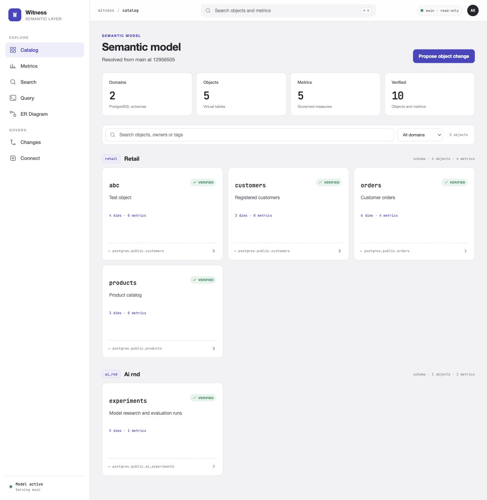
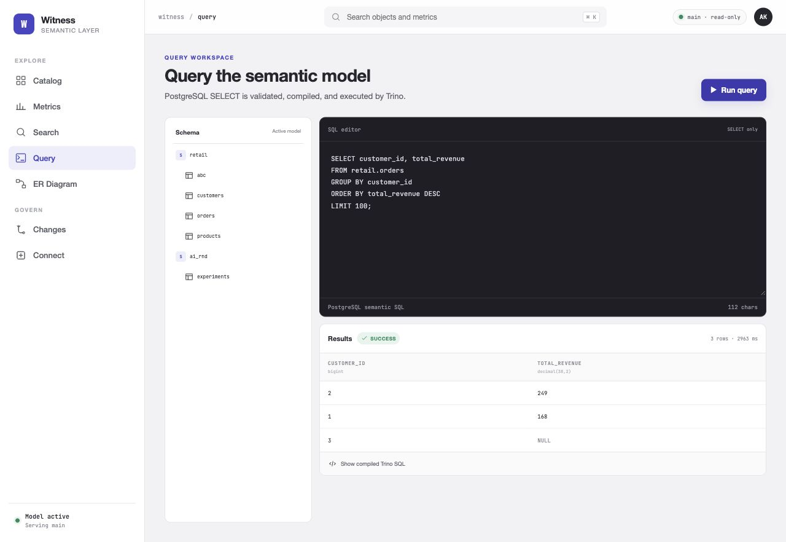
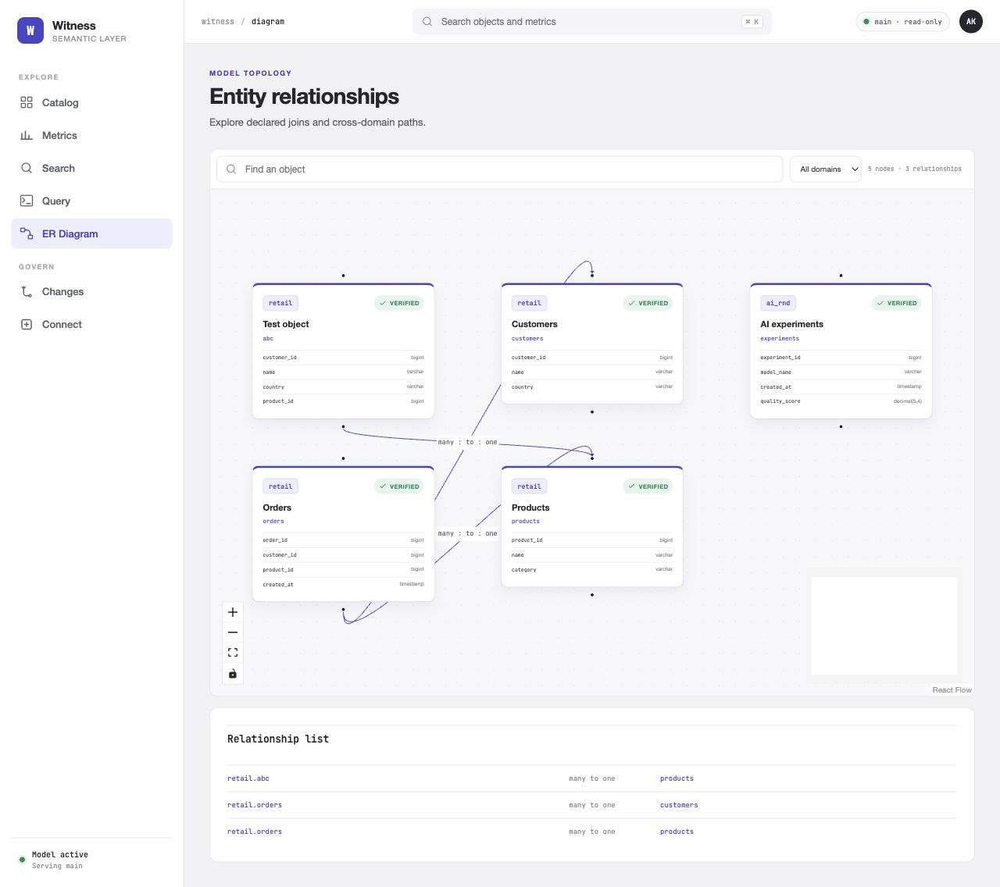
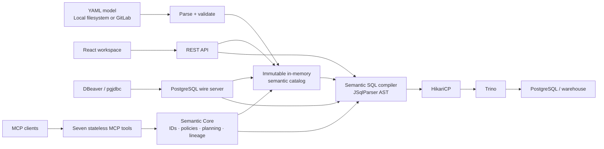

<div align="center">

# Witness

### A fair witness for your metrics

Design business meaning in visual builders or YAML, query it through SQL, and govern production changes through GitLab Merge Requests.


[Quick start](#quick-start) · [How it works](#how-it-works) · [Architecture decisions](docs/architecture-decisions.md) · [Model example](#semantic-model) · [Connect with DBeaver](#connect-over-postgresql) · [Governance](#governance-modes)

</div>

---

## Why this project exists

Analytics teams often calculate the same KPI differently across dashboards, notebooks, and services. This project gives those definitions a shared, reviewable home.

Witness turns YAML definitions into a validated runtime catalog and presents domains as PostgreSQL schemas, objects as tables, dimensions as columns, and metrics as governed measures.

The name is inspired by Robert A. Heinlein's **Fair Witness**: an observer trained to report only what the available evidence supports. Witness applies the same principle to analytical data—definitions are explicit, lineage is visible, and the engine refuses to invent certainty when a query cannot be proven safe.

```sql
SELECT
    customer_id,
    total_revenue
FROM retail.orders
GROUP BY customer_id
ORDER BY total_revenue DESC;
```

`total_revenue` is not a physical database column. It is a governed metric compiled into its approved aggregation and filters before Trino executes the query.

## Highlights

- **Git-first semantic model** — objects, dimensions, relationships, and metrics live in human-readable YAML.
- **Domains become schemas** — `retail.orders` and `ai_rnd.experiments` are discoverable from PostgreSQL clients.
- **PostgreSQL-compatible endpoint** — connect with DBeaver or pgjdbc and browse the semantic catalog like a database.
- **Governed MCP interface** — discover metadata, inspect context and lineage, compile typed queries, and execute small metric results through seven strict tools.
- **AST-based SQL compiler** — registered semantic fields are compiled into physical Trino SQL without string substitution.
- **Governed metrics** — reusable aggregations, filters, result types, formats, ownership, and descriptions.
- **Safe-by-default joins** — declared relationships are validated and known fan-out risks are rejected instead of returning incorrect totals.
- **Derived objects** — an object can resolve to one physical table or to a governed read-only SELECT joining several fully qualified Trino tables.
- **Visual YAML builders** — create and edit objects or metrics with regular forms while Witness generates the specification live.
- **Complete local CRUD** — create, update, move between domains, and safely delete validated objects and metrics during development.
- **GitLab workflow** — production changes become atomic commits and Merge Requests; the application never merges its own changes.
- **Web workspace** — catalog, metric registry, SQL editor, global search, lineage, ER diagram, connection guide, and governed change wizard.
- **Immutable active model** — a candidate revision becomes active only after complete parsing and validation.

## Product tour

<table>
  <tr>
    <td width="50%">
      
      <br />
      <sub><strong>Semantic catalog</strong> — domains, objects, ownership, and trust signals.</sub>
    </td>
    <td width="50%">
      
      <br />
      <sub><strong>Query workspace</strong> — semantic SQL, typed results, and compiled Trino SQL.</sub>
    </td>
  </tr>
</table>

<p align="center">
  
  <br />
  <sub><strong>Model topology</strong> — declared relationships and cross-domain paths.</sub>
</p>

## How it works



There are three deliberately separate storage concerns:

| Concern | Current source of truth |
|---|---|
| Semantic definitions | YAML files locally or YAML in GitLab |
| Active semantic catalog | Immutable in-memory snapshot |
| Business data | PostgreSQL in the demo; any Trino-accessible source in a real deployment |

The application does **not** store semantic objects or metrics in PostgreSQL. The database contains business rows; the semantic model describes how those rows should be understood and queried.

The rationale, trade-offs, and boundaries behind pgwire, Trino, and immutable catalog activation are
recorded in the [architecture decision records](docs/architecture-decisions.md).

## Quick start

### Requirements

- Docker 24+
- Docker Compose v2

### Start the complete demo

```bash
docker compose up --build -d
docker compose ps
```

Docker starts the complete data path:

| Service | Address | Purpose |
|---|---|---|
| Web UI | [localhost:3000](http://localhost:3000) | Catalog and semantic workspace |
| Backend API | [localhost:8080](http://localhost:8080) | REST and application services |
| OpenAPI | [localhost:8080/swagger-ui.html](http://localhost:8080/swagger-ui.html) | Interactive API documentation |
| Readiness | [localhost:8080/actuator/health/readiness](http://localhost:8080/actuator/health/readiness) | Backend health |
| Trino | [localhost:8081](http://localhost:8081) | Query engine |
| Semantic pgwire | `localhost:55433` | PostgreSQL-compatible semantic endpoint |
| Demo PostgreSQL | `localhost:5434` | Physical development data |

The demo database is initialized from [`demo-data/init.sql`](demo-data/init.sql) with customers, products, orders, and AI experiments.

### Run the complete GitLab-governed demo

The regular quick start uses local filesystem governance. To demonstrate the complete
branch → commit → Merge Request → merge → activation flow, run:

```bash
./scripts/gitlab-demo.sh
```

This adds a pinned GitLab CE container, creates an idempotent local demo token and the
private `root/witness` project, seeds the current semantic model into `main`, and starts
Witness with GitLab as its source of truth.

> GitLab CE is a large image and needs substantially more resources than the rest of the
> demo. Allow roughly 6 GB of Docker memory and several minutes for the first startup.

| Service | Address | Local demo credentials |
|---|---|---|
| Witness | [localhost:3000](http://localhost:3000) | — |
| GitLab project | [localhost:8929/root/witness](http://localhost:8929/root/witness) | `root` / `WitnessDemo123!` |

Demo flow:

1. Open Witness and select **Create object**, or open an existing object and select
   **Edit object**. From the metric registry, select **Create metric** and choose the
   existing base object that owns the metric.
2. Fill in the visual form. The generated YAML updates live beside it; no YAML knowledge
   is required.
3. Select **Review generated YAML**, validate the complete candidate model, review the
   diff, and select **Create Merge Request**.
4. To update or delete an object, return to **Edit object**. Witness refuses deletion while
   a metric or incoming relationship still depends on the object.
5. Open the generated MR in GitLab and merge it into `main`.
6. Return to Witness. The backend polls `main` every five seconds and the catalog refreshes
   automatically; the merged create, update, or deletion appears within roughly ten seconds.

The credentials and API token in this overlay are intentionally fixed and are only suitable
for an isolated localhost demo. GitLab state is persisted in named Docker volumes. A normal
shutdown preserves it:

```bash
docker compose -f docker-compose.yml -f docker-compose.gitlab.yml down
```

To deliberately erase the local GitLab project and start over, add `--volumes` to that
command. This permanently deletes the demo GitLab data.

### Run your first semantic query

Open the [query workspace](http://localhost:3000/query) or call the REST API:

```bash
curl --request POST http://localhost:8080/api/v1/query \
  --header 'Content-Type: application/json' \
  --header 'X-API-Key: dev-secret' \
  --data '{
    "sql": "SELECT customer_id, total_revenue FROM retail.orders GROUP BY customer_id ORDER BY total_revenue DESC",
    "parameters": []
  }'
```

## Semantic model

The model is stored under [`semantic-model/`](semantic-model):

```text
semantic-model/
├── project.yaml
├── objects/
│   ├── customers.yaml
│   ├── experiments.yaml
│   ├── orders.yaml
│   └── products.yaml
├── metrics/
│   ├── average_model_quality.yaml
│   ├── average_order_value.yaml
│   ├── order_count.yaml
│   ├── total_revenue.yaml
│   └── unique_customers.yaml
└── schema/
    ├── metric.schema.json
    ├── object.schema.json
    └── project.schema.json
```

The parser discovers YAML recursively by its `kind`, so domain-oriented paths such as `domains/retail/metrics/gross_margin.yaml` are supported as well.

You do not have to author these documents by hand. The object and metric builders expose
metadata, physical source, dimensions, primary keys, relationships, aggregations, filters,
and ownership as HTML controls. They continuously generate the exact YAML shown below.
Expert users can still inspect or adjust that YAML during the change review.

### Object example

An object maps a governed name to a physical Trino source:

```yaml
version: 1
kind: object

metadata:
  name: orders
  domain: retail
  label: Orders
  description: Customer orders
  owner: analytics-platform
  tags: [sales, finance]

spec:
  source:
    catalog: postgres
    schema: public
    table: orders

  primaryKey: [order_id]

  dimensions:
    - name: order_id
      label: Order ID
      type: bigint
      sql: order_id
      nullable: false

    - name: amount
      label: Order amount
      type: decimal(18,2)
      sql: amount

  relationships:
    - name: order_customer
      targetObject: customers
      sourceFields: [customer_id]
      targetFields: [customer_id]
      cardinality: many_to_one
      defaultJoinType: left
```

### Derived object example

For a business object assembled from several physical tables, replace
`catalog/schema/table` with one governed `select`:

```yaml
version: 1
kind: object

metadata:
  name: order_customer_facts
  domain: retail
  label: Order customer facts
  description: Orders enriched with customer attributes
  owner: sales-analytics
  tags: [sales, customer]

spec:
  source:
    select: |
      SELECT
        o.order_id,
        o.customer_id,
        o.amount,
        o.status,
        c.country
      FROM postgres.public.orders o
      LEFT JOIN postgres.public.customers c
        ON c.customer_id = o.customer_id

  primaryKey: [order_id]

  dimensions:
    - name: order_id
      type: bigint
      sql: order_id
      nullable: false
    - name: country
      type: varchar
      sql: country

  relationships: []
```

Witness validates this source as one read-only SELECT and compiles semantic queries as
`FROM (<derived SELECT>) object_alias`. Physical tables must use
`catalog.schema.table`; comments, parameters, DML, DDL, statement separators, CTEs,
and set operations fail closed. Dimensions and metrics reference the columns projected
by the SELECT, so the object remains available through REST, JDBC, DBeaver, and the
regular semantic SQL compiler.

### Metric example

```yaml
version: 1
kind: metric

metadata:
  name: total_revenue
  domain: retail
  label: Total revenue
  description: Revenue from completed orders
  owner: finance-analytics
  tags: [revenue, finance]

spec:
  baseObject: orders
  aggregation: sum
  expression: amount
  resultType: decimal(18,2)
  format: currency
  filters:
    - field: status
      operator: in
      values: [paid, completed]
```

The compiler produces the governed physical expression:

```sql
SUM("orders"."amount") FILTER (
    WHERE "orders"."status" IN ('paid', 'completed')
)
```

Both `total_revenue` and BI-style `SUM(total_revenue)` resolve to the same metric without accidental double aggregation.

## Connect over PostgreSQL

Use the PostgreSQL driver in DBeaver or any pgjdbc application.

```text
JDBC URL: jdbc:postgresql://localhost:55433/semantic?sslmode=disable
Username: semantic
Password: semantic
Database: semantic
```

Java example:

```java
try (var connection = DriverManager.getConnection(
        "jdbc:postgresql://localhost:55433/semantic?sslmode=disable",
        "semantic",
        "semantic")) {
    // Use regular JDBC metadata, statements, and prepared statements.
}
```

PostgreSQL clients discover:

```text
semantic
├── retail
│   ├── customers
│   ├── orders
│   └── products
└── ai_rnd
    └── experiments
```

Schemas, objects, columns, primary keys, imported keys, and metrics are generated from the active semantic model. They are virtual metadata—not physical PostgreSQL tables created by this application.

### Supported SQL behavior

- Read-only `SELECT` subset
- Registered semantic objects, dimensions, and metrics
- Declared single-hop joins
- `WHERE`, `GROUP BY`, `HAVING`, `ORDER BY`, and bounded `LIMIT`
- JDBC parameters through pgwire and REST
- Explicit scalar and aggregate function allow-lists
- `SELECT *` expansion to dimensions only; metrics must be requested explicitly
- Maximum result and SQL limits

Model expressions pass through a separate fail-closed AST policy. Subqueries, qualified cross-table references, unknown functions, comments, multi-statements, DML, DDL, set operations, and unregistered physical tables are rejected.

### Fan-out correctness

The compiler uses declared relationship cardinality to protect metric correctness. Until full symmetric aggregation is implemented, a query is rejected when a join could multiply the rows behind a metric.

- `one_to_one` is considered row-preserving.
- A metric on the many side of `many_to_one` is supported.
- Unsafe `one_to_many` and `many_to_many` metric paths fail closed.

An explicit error is preferable to a plausible but incorrect business number.

## Web workspace

The React application includes:

- Domain-grouped semantic catalog
- Object detail with dimensions, metrics, relationships, lineage, and YAML
- Visual object builder with live YAML, dynamic dimensions and relationships, primary-key
  selection, table/derived-SELECT source modes, and dependency-aware deletion
- Metric registry with a **Create metric** action, mandatory base-object selection, and a
  visual metric builder with live YAML and expression validation
- Global semantic search
- SQL workspace with results and compiled Trino SQL
- ER diagram powered by React Flow
- DBeaver and pgjdbc connection guide
- Validation and diff preview
- Four-step GitLab Merge Request workflow

## Governance modes

| Capability | Local development | GitLab governed mode |
|---|---|---|
| Model source | Local YAML directory | GitLab default branch |
| Object create/update/delete | Atomic validated YAML write | Proposed through branch + MR |
| Metric create/update/delete | Atomic validated YAML write | Proposed through branch + MR |
| Domain move | Move YAML and reload atomically | Delete old path + create new path in one MR |
| Activation | Validate and reload immediately | After merge, polling, and validation |
| Change preview | Validation and diff | Validation, diff, base revision, affected entities |
| Conflict protection | Local synchronization | Default-branch SHA check |

### Enable GitLab mode

```bash
export GITLAB_ENABLED=true
export GITLAB_BASE_URL=https://gitlab.example.com
export GITLAB_PROJECT_ID=data/semantic-model
export GITLAB_TOKEN=replace-me
export GITLAB_DEFAULT_BRANCH=main
export GITLAB_MODEL_PATH=semantic-model
```

The adapter reads the complete paginated repository tree, loads YAML from the default branch, validates candidate revisions, creates a unique branch, commits all file actions atomically, and opens a Merge Request. It never merges or activates an unmerged branch.

When `GITLAB_ENABLED=false`, no real GitLab connection is made. Development uses local YAML, and automated GitLab tests use a mocked HTTP server.

## REST API

All `/api/v1/**` endpoints currently require:

```text
X-API-Key: dev-secret
```

Key endpoint groups:

| Area | Endpoints |
|---|---|
| Catalog | `GET /objects`, `/objects/{name}`, `/metrics`, `/metrics/{name}` |
| Object CRUD | `POST /objects`, `PUT /objects/{name}`, `DELETE /objects/{name}` |
| Metric CRUD | `POST /metrics`, `PUT /metrics/{name}`, `DELETE /metrics/{name}` |
| Model | `GET /model`, `/model/status`, `POST /model/validate`, `/model/reload` |
| Query | `POST /query`, `POST /validate` |
| Discovery | `GET /relationships`, `/graph`, `/search`, `/objects/{name}/source` |
| Governance | `POST /changes/validate`, `/changes/submit` |

Errors include a correlation ID. Unexpected server failures are logged internally while clients receive a generic response.

## Model Context Protocol (MCP)

Witness exposes a stateless Streamable HTTP endpoint at `http://localhost:8080/api/mcp`. It
publishes exactly seven read-only discovery and analytical tools:

1. `search_semantic_objects`
2. `get_semantic_object`
3. `get_metric_context`
4. `get_dimension_values`
5. `compile_semantic_query`
6. `query_metrics`
7. `get_lineage`

Every request uses `X-API-Key`, stable domain-qualified IDs, the active semantic revision, and the
same catalog, compiler, relationship rules, limits, and Trino executor as the rest of Witness. Raw
SQL and caller-supplied identities are not part of the MCP contract. See the complete
[MCP architecture, contracts, examples, security model, and limitations](docs/mcp.md).

## Configuration

| Environment variable | Default | Purpose |
|---|---:|---|
| `MODEL_PATH` | `semantic-model` | Local semantic YAML directory |
| `REST_API_KEY` | `dev-secret` | Development REST authentication |
| `PGWIRE_PORT` | `5433` | pgwire port inside the backend container |
| `PGWIRE_HOST_PORT` | `55433` | Published Docker host port |
| `PGWIRE_USERNAME` | `semantic` | SQL username |
| `PGWIRE_PASSWORD` | `semantic` | SQL password |
| `PGWIRE_MAX_FRAME_BYTES` | `1048576` | Maximum accepted pgwire packet |
| `PGWIRE_MAX_PREPARED_STATEMENTS` | `256` | Statements and portals per connection |
| `TRINO_JDBC_URL` | `jdbc:trino://localhost:8081/...` | Trino JDBC endpoint |
| `TRINO_USERNAME` | `semantic` | Trino user |
| `TRINO_PASSWORD` | empty | Trino password |
| `TRINO_POOL_SIZE` | `10` | Maximum pooled Trino connections |
| `TRINO_CONNECTION_TIMEOUT_MS` | `10000` | Pool acquisition timeout |
| `QUERY_TIMEOUT_SECONDS` | `30` | Query timeout |
| `QUERY_MAX_ROWS` | `10000` | Result-row cap |
| `GITLAB_CONNECT_TIMEOUT_SECONDS` | `5` | GitLab connection timeout |
| `GITLAB_READ_TIMEOUT_SECONDS` | `20` | GitLab response timeout |
| `MODEL_POLL_MS` | `60000` | Default-branch polling interval |
| `MCP_ENABLED` | `true` | Enable the stateless MCP endpoint |
| `MCP_ENDPOINT` | `/api/mcp` | Streamable HTTP endpoint path |
| `MCP_SEARCH_MAX_RESULTS` | `50` | Maximum discovery page |
| `MCP_QUERY_DEFAULT_ROWS` | `100` | Default MCP result rows |
| `MCP_QUERY_MAX_ROWS` | `500` | Hard MCP result-row limit |
| `MCP_DIMENSION_DEFAULT_ROWS` | `20` | Default dimension-values page |
| `MCP_DIMENSION_MAX_ROWS` | `100` | Maximum dimension-values page |
| `MCP_LINEAGE_MAX_DEPTH` | `5` | Maximum lineage depth |
| `MCP_LINEAGE_MAX_NODES` | `250` | Maximum lineage graph nodes |
| `MCP_EXPOSE_COMPILED_SQL` | `false` | Allow SQL only when policy also permits it |
| `MCP_EXPOSE_PHYSICAL_LINEAGE` | `false` | Allow physical nodes only when policy also permits it |

## Development

### Backend

```bash
./gradlew test
./gradlew bootRun
```

Running only `bootRun` does not start Trino or PostgreSQL. The recommended setup is the complete Docker Compose stack, or Docker for data services with the backend running locally.

### Frontend

```bash
cd frontend
npm install
npm test
npm run build
npm run dev
```

### Project layout

```text
.
├── backend/src/main/java/com/acme/semantic/
│   ├── api/          REST controllers, security, object and metric CRUD
│   ├── catalog/      active immutable semantic model
│   ├── core/         stable IDs, policies, discovery, typed queries, and lineage
│   ├── compiler/     AST validation and semantic SQL compilation
│   ├── config/       application and connection-pool configuration
│   ├── execution/    Trino query execution
│   ├── gitlab/       local and GitLab model repositories
│   ├── model/        model records and YAML parser
│   ├── mcp/          strict schemas and stateless MCP transport adapter
│   ├── pgwire/       PostgreSQL protocol and metadata facade
│   └── validation/   model and governance validation
├── backend/src/test/ Java unit and integration tests
├── frontend/         React + TypeScript workspace
├── semantic-model/   demo semantic definitions and JSON schemas
├── demo-data/        physical PostgreSQL demo data
├── trino/catalog/    Trino connector configuration
└── docker-compose.yml
```

## Validation and safety model

A revision is activated only when the complete model passes validation, including:

- YAML structure and supported schema version
- Safe identifiers and controlled semantic types
- Required labels, descriptions, and owners
- Primary keys and relationship field compatibility
- Relationship cardinality supported by declared keys
- Metric base objects, filters, formats, and result types
- Metric/dimension name collisions
- Fail-closed model-expression AST policy
- Fail-closed derived-source SELECT policy with fully qualified physical tables
- Metric fields resolved through registered dimensions
- MCP canonical query types, unique relationship paths, and bounded result plans

If polling, parsing, or validation fails, the previous valid revision remains active and the catalog reports an unhealthy status.

## MVP boundaries

This repository is a working vertical MVP, not a production-ready database server.

- REST authentication uses one development API key; production OIDC, RBAC, and attributable audit events are not implemented yet.
- MCP has per-tool audit events, but uses the same single API-key principal until production OIDC/RBAC is introduced.
- YAML schema v1 does not model row/column policies, freshness SLAs, currency conversion, or source timezones; the default MCP policy does not invent them, while Semantic Core exposes typed production policy hooks.
- The UI's current “verified” badge is inferred from owner and description; it is not a persisted certification workflow.
- pgwire uses cleartext password authentication and no TLS; keep it local or behind trusted TLS termination.
- PostgreSQL protocol coverage is intentionally narrow: no COPY, cursors, LISTEN/NOTIFY, cancel requests, or arbitrary system catalogs.
- Canonical MCP queries support unique multi-hop relationship paths and reject fan-out; full symmetric aggregation remains roadmap work.
- GitLab is mocked in automated tests; a real GitLab API is used only when governed mode is configured.
- The demo PostgreSQL container has no persistent data volume and is recreated from `init.sql`.

## Roadmap

- [ ] OIDC authentication and role-based authorization
- [ ] Append-only audit store for changes, approvals, and model activation
- [ ] Explicit metric certification tied to definition hash and revision
- [ ] Fan-out-safe pre-aggregation and symmetric aggregates
- [ ] Additivity, time-grain, and non-additive dimension metadata
- [ ] TLS/SCRAM and broader PostgreSQL client compatibility
- [ ] Structured derived metrics and richer lineage
- [ ] Persistent production deployment examples

## Troubleshooting

<details>
<summary><strong>No valid semantic model loaded</strong></summary>

Call `GET /api/v1/model/status` with the API key. Fix the reported YAML file/path and trigger `POST /api/v1/model/reload`. The previous valid revision remains active whenever possible.

</details>

<details>
<summary><strong>Trino or demo data is unavailable</strong></summary>

```bash
docker compose ps
docker compose logs trino demo-db
```

Confirm that the Trino PostgreSQL connector can reach `demo-db:5432` inside the Compose network.

</details>

<details>
<summary><strong>DBeaver cannot connect</strong></summary>

Use `semantic / semantic`, port `55433`, and add `?sslmode=disable` to the JDBC URL. If DBeaver cached old metadata, invalidate and reconnect the connection.

</details>

<details>
<summary><strong>Query rejected because of fan-out</strong></summary>

The compiler cannot prove that the join preserves the metric's base grain. Query the metric from its safe side of the relationship or wait for fan-out-safe pre-aggregation support; do not bypass the rejection with physical SQL.

</details>

---

<div align="center">

**Witness reports what the model can prove.**

</div>
