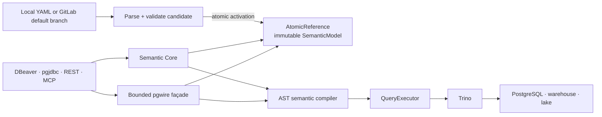
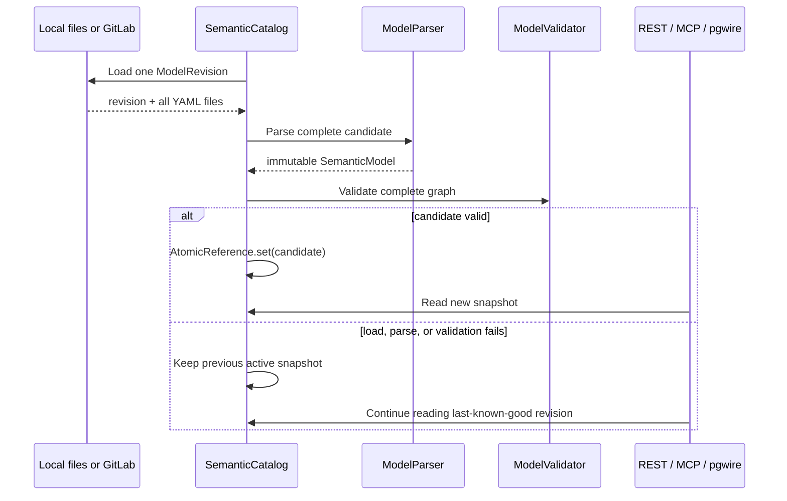

# Witness architecture decision records

This document records the architectural decisions that define the runtime boundary of Witness.
It is intentionally focused on decisions that are easy to misunderstand from the UI alone:
the PostgreSQL-compatible endpoint, Trino execution, and the immutable active catalog.

Each record describes the current implementation, its trade-offs, and the conditions under which
the decision should be revisited. New decisions should be appended rather than rewriting the
history of an accepted record. A materially changed decision should supersede the old record with
a new ADR.

## Decision summary

| ADR | Decision | Status |
|---|---|---|
| [ADR-001](#adr-001-expose-semantic-sql-through-a-bounded-postgresql-wire-protocol-facade) | Expose semantic SQL through a bounded PostgreSQL wire protocol façade | Accepted |
| [ADR-002](#adr-002-use-trino-as-the-physical-query-execution-engine) | Use Trino as the physical query execution engine | Accepted |
| [ADR-003](#adr-003-serve-a-validated-immutable-catalog-snapshot) | Serve a validated immutable catalog snapshot | Accepted |
| [ADR-004](#adr-004-project-semantic-relationships-as-virtual-postgresql-foreign-keys) | Project semantic relationships as virtual PostgreSQL foreign keys | Accepted |



## ADR-001: Expose semantic SQL through a bounded PostgreSQL wire protocol façade

- **Status:** Accepted
- **Date:** 2026-08-17
- **Owners:** Witness maintainers

### Context

Analysts and data engineers already use PostgreSQL-aware tools such as DBeaver and pgjdbc. Asking
every client to learn a proprietary protocol would make the semantic layer harder to adopt.
However, Witness is not a PostgreSQL database: it does not own business rows, implement PostgreSQL
storage, or promise the complete PostgreSQL language and system catalog.

The endpoint therefore needs enough protocol and metadata compatibility for discovery, prepared
queries, and small analytical result sets while keeping all SQL inside the governed semantic
compiler.

### Decision

Witness exposes a dedicated Netty-based PostgreSQL wire server. It is a compatibility façade over
the semantic catalog and query pipeline, not a second database.

The implementation follows these rules:

1. Semantic domains appear as PostgreSQL schemas, semantic objects as tables, and dimensions plus
   metrics as columns.
2. DBeaver and pgjdbc metadata requests are answered from the in-memory semantic catalog through a
   deliberately small emulation of `pg_catalog` and `information_schema`.
3. User analytical `SELECT` statements are parsed and compiled against the active semantic model,
   then passed to the shared `QueryExecutor`. They never execute against a PostgreSQL store inside
   Witness.
4. Both the simple query flow and the extended `Parse → Bind → Describe → Execute` flow are
   supported. Prepared statements and portals are connection-scoped and bounded by configuration.
5. JDBC parameters are kept separate from compiled SQL. Results are currently returned in the
   PostgreSQL text format; a small set of binary parameter representations is accepted.
6. Only the compatibility session commands required by supported clients are emulated. `BEGIN`,
   `COMMIT`, selected `SET`/`SHOW` commands, and session metadata do not create a transactional
   storage boundary in Witness.
7. Frame size and prepared-statement counts are bounded. Authentication uses the configured
   service username and password with constant-time comparison.
8. TLS is not terminated by the embedded server: an SSL negotiation request is rejected. The
   endpoint must stay on a trusted network or sit behind trusted TLS termination.

### Consequences

Positive consequences:

- Existing PostgreSQL clients can browse and query semantic objects without a custom driver.
- One compiler and execution path is shared by pgwire, REST, and MCP.
- Metadata discovery does not query Trino and remains available while a data source is slow.
- PostgreSQL SQLSTATE-style errors can be returned to JDBC clients.

Costs and limitations:

- PostgreSQL compatibility is intentionally partial. Witness does not support arbitrary system
  catalogs, DDL, DML, `COPY`, server-side cursors, `LISTEN`/`NOTIFY`, cancellation requests, or
  PostgreSQL transaction semantics.
- Client-specific introspection queries may require explicit compatibility work.
- Cleartext password authentication without embedded TLS is unsuitable for direct public exposure.
- Advertising PostgreSQL compatibility can create expectations that must be constrained clearly in
  documentation and tests.

### Alternatives considered

- **Expose Trino directly.** Rejected because Trino exposes physical catalogs and does not present
  the governed semantic namespace or enforce the Witness semantic compiler by itself.
- **Build a custom JDBC driver.** Rejected for the MVP because it creates client deployment and
  maintenance work and does not integrate naturally with generic database tools.
- **Store semantic objects as PostgreSQL views.** Rejected because it couples governance to one
  physical database and weakens multi-source execution through Trino.
- **Claim full PostgreSQL compatibility.** Rejected because implementing a database server is not a
  product goal and would obscure the semantic-layer boundary.

### Revisit when

Reconsider the embedded implementation if production clients require TLS termination in-process,
OAuth or per-user database identities, cancellation, cursor-based streaming, broad BI-tool system
catalog compatibility, or protocol coverage that is better provided by a maintained pgwire library
or a dedicated gateway.

## ADR-002: Use Trino as the physical query execution engine

- **Status:** Accepted
- **Date:** 2026-08-17
- **Owners:** Witness maintainers

### Context

A semantic object may map to a table or a governed derived `SELECT`, and a useful business model can
span several physical systems. Witness needs one execution boundary that understands fully
qualified sources, joins, aggregation, and federation without embedding source-specific engines in
the application.

### Decision

Trino is the physical query execution engine. Witness owns semantic validation and planning; Trino
owns physical access and execution.

The execution path is:

```text
semantic SQL or canonical query
  → resolve IDs and relationships against one catalog snapshot
  → validate supported syntax, expressions, joins, and fan-out
  → compile parameterized, fully qualified Trino SQL
  → execute through QueryExecutor and the Trino JDBC driver
  → return typed, bounded rows
```

Additional rules:

1. Application services depend on the `QueryExecutor` interface. `TrinoQueryExecutor` is the runtime
   implementation, keeping protocol adapters independent of JDBC details.
2. The compiler uses an SQL AST and allow-listed semantic expressions; it does not substitute user
   strings into physical SQL.
3. Runtime values are bound as `PreparedStatement` parameters.
4. A read-only HikariCP pool owns Trino JDBC connections. Pool size and acquisition timeout are
   configurable, and application startup is allowed even when Trino is temporarily unavailable.
5. Every statement receives a query timeout and row cap. REST, MCP, and pgwire can impose smaller
   interface-specific bounds but cannot bypass the executor maximum.
6. JDBC result metadata supplies physical types and nullability; semantic column names and units are
   restored by the calling layer where applicable.
7. Trino SQLSTATE is preserved when available and wrapped as a controlled query execution error.
8. The local demo uses Trino's PostgreSQL connector, but the architecture permits any source exposed
   through an approved Trino catalog.

### Consequences

Positive consequences:

- The semantic layer can federate warehouses, databases, and lake sources behind one execution API.
- Witness remains focused on governance, metadata, and safe query generation rather than building a
  distributed execution engine.
- Physical connectivity and connector behavior stay in Trino configuration.
- All public query protocols converge on the same execution boundary and limits.

Costs and limitations:

- Trino is an operational dependency for data queries; catalog browsing can work without it, but
  result-producing calls cannot.
- Trino and connector semantics influence supported types, functions, timezones, and error messages.
- JDBC cancellation on client disconnect is not currently wired through; statement timeout remains
  the final guard.
- The executor does not currently expose Trino's engine query ID, distributed progress, or async job
  lifecycle.
- Read-only Hikari configuration is a safety signal, not a substitute for read-only Trino identities
  and connector-level permissions.

### Alternatives considered

- **Connect directly to every physical database.** Rejected because it duplicates dialect,
  credential, pooling, and federation logic inside Witness.
- **Use PostgreSQL as the only engine.** Rejected because it restricts the semantic layer to one
  backend and conflates the pgwire façade with physical storage.
- **Use an embedded analytical engine.** Rejected for the MVP because production federation and
  connector operations would still need a separate solution.
- **Allow clients to send physical Trino SQL.** Rejected because it bypasses semantic IDs,
  relationship validation, governed metrics, and access policy hooks.

### Revisit when

Revisit the execution boundary if workloads require asynchronous jobs, streaming pages, query
cancellation, engine query IDs, multi-engine routing, cost-based planning, or workload management
that cannot be expressed cleanly through the current `QueryExecutor` contract.

## ADR-003: Serve a validated immutable catalog snapshot

- **Status:** Accepted
- **Date:** 2026-08-17
- **Owners:** Witness maintainers

### Context

Objects, dimensions, relationships, and metrics must form one internally consistent graph. Serving
partially updated YAML files would let a request observe a new metric with an old object, a broken
relationship, or definitions from different Git revisions. A failed production change must not
take the last valid catalog offline.

### Decision

Witness builds a complete immutable `SemanticModel` candidate and activates it with one atomic
reference swap only after parsing and validation succeed.



The snapshot rules are:

1. The source of truth is YAML: the local model directory in development or the configured GitLab
   default branch in governed mode. PostgreSQL is not used to store semantic definitions.
2. A `ModelRevision` contains a revision identifier and the complete file set. GitLab uses the
   default-branch commit SHA; local mode hashes the sorted paths and contents.
3. Parsing rejects unknown YAML properties and builds the complete candidate before activation.
4. Validation runs against the complete candidate, including global IDs, object/metric references,
   relationships, types, and expression policies.
5. `SemanticModel` uses records plus defensive immutable copies for maps and nested collections.
6. `SemanticCatalog.reload()` is synchronized so candidate activations do not race. Readers access
   the current snapshot through an `AtomicReference`, without locks or in-place mutation.
7. Load, parse, validation, and polling failures never replace the active model. Health status becomes
   unhealthy and records the last active revision while requests continue on the last-known-good
   snapshot.
8. Polling compares repository revisions and reloads only when the default revision changes. Manual
   reload and local CRUD use the same candidate validation and activation path.
9. GitLab authoring creates a branch and Merge Request; it does not mutate the active catalog. A
   merged default-branch revision becomes visible only after a successful reload.
10. Revision identifiers are returned where clients need consistency. Revision-bound pagination
    cursors are rejected after activation of another revision.

A snapshot is immutable, but Witness does not provide cross-request MVCC. Code that requires one
revision for a complete operation must capture `catalog.model()` once and pass that instance through
planning and compilation. Holding an older snapshot remains safe while a newer one is activated.

### Consequences

Positive consequences:

- Readers never observe a partially loaded or partially validated model.
- Reads are cheap and lock-free after obtaining the current snapshot.
- A bad Git commit or transient repository failure does not replace the last valid catalog.
- Every response can be associated with a concrete semantic revision for audit and reproducibility.
- Local development and GitLab governance share the same runtime validation boundary.

Costs and limitations:

- Reload builds another complete model in memory; peak memory temporarily includes old and new
  snapshots.
- Large catalogs pay full parse and validation cost instead of incremental mutation.
- The process retains only the active snapshot, not a queryable revision history.
- Multiple Witness replicas poll independently. Git revision identity makes their state observable,
  but activation is not coordinated as a distributed transaction.
- A valid semantic snapshot does not guarantee that every referenced physical source is currently
  reachable; physical failures remain execution-time concerns.

### Alternatives considered

- **Mutate catalog maps in place.** Rejected because concurrent readers could observe mixed revisions
  and because rollback after validation failure becomes unsafe.
- **Store active definitions in an application database.** Rejected because YAML/Git is the reviewable
  source of truth and adding a mutable shadow store creates synchronization and provenance problems.
- **Activate each changed file independently.** Rejected because metrics, objects, and relationships
  are one consistency boundary.
- **Drop the active model when reload fails.** Rejected because a bad candidate should affect health
  and authoring feedback, not erase the last validated production model.

### Revisit when

Revisit full-snapshot activation if catalog size makes complete reloads too expensive, production
requires coordinated activation across replicas, or users need time-travel queries. Any incremental
design must preserve atomic graph validation, explicit revisions, and last-known-good rollback.

## ADR-004: Project semantic relationships as virtual PostgreSQL foreign keys

- **Status:** Accepted
- **Date:** 2026-08-18
- **Owners:** Witness maintainers

### Context

Witness relationships already define governed joins between semantic objects. PostgreSQL-aware
tools, however, understand object topology through primary-key and foreign-key metadata. If the
pgwire façade exposes only tables and columns, DBeaver cannot draw the same relationships that the
semantic compiler uses. Maintaining a second JDBC-only relationship definition would create drift.

The semantic objects can be backed by physical tables, derived `SELECT` statements, or sources in
different Trino catalogs. Therefore these keys cannot truthfully be advertised as constraints
physically enforced by PostgreSQL or by the underlying data sources.

### Decision

The active semantic relationship is the single source of truth. Witness deterministically projects
validated relationships into read-only, non-enforced PostgreSQL key metadata:

| Semantic cardinality | Virtual relational projection |
|---|---|
| `many_to_one` | Declaring/source object FK → target object PK |
| `one_to_one` | Declaring/source object FK → target object PK |
| `one_to_many` | Target/many object FK → declaring/source object PK |
| `many_to_many` | No single FK; model an explicit bridge object with two relationships |

The projection follows these rules:

1. `sourceFields` and `targetFields` preserve the declared composite-key pairing. The existing
   cardinality validation proves that the referenced one-side fields are that object's primary key.
2. Domains become key schemas, so cross-domain relationships remain visible. A derived object is
   treated exactly like a table-backed object because the metadata describes its semantic grain,
   not source DDL.
3. Relationship names become FK constraint names. Names must be safe SQL identifiers and are unique
   within the declaring object, ignoring case.
4. The pgwire façade answers pgjdbc's standard `getPrimaryKeys`, `getImportedKeys`,
   `getExportedKeys`, and `getCrossReference` catalog queries from the same active snapshot.
5. `information_schema.table_constraints`, `key_column_usage`, and
   `referential_constraints` expose the same projection. Virtual constraints report
   `enforced = NO`, `NO ACTION` update/delete rules, and non-deferrable JDBC metadata.
6. The projection is metadata-only. It creates no PostgreSQL DDL, does not mutate a physical
   source, and does not add runtime referential-integrity checks to query execution.

### Consequences

Positive consequences:

- DBeaver and other JDBC tools can render an ER graph consistent with Witness join semantics.
- There is no duplicate relationship registry to synchronize with YAML.
- Composite, cross-domain, and derived-object relationships remain discoverable.
- Metadata remains available without Trino or a PostgreSQL metadata database.

Costs and limitations:

- A displayed FK is a semantic assertion, not proof that source rows satisfy referential integrity.
- A `many_to_many` edge cannot be represented honestly as one FK and is intentionally omitted.
- Client tools may display virtual keys as ordinary database constraints unless users read the
  `enforced` metadata or Witness documentation.
- Additional client-specific catalog queries may require compatibility work in the bounded pgwire
  façade.

### Alternatives considered

- **Create constraints in source systems.** Rejected because Witness may not own those systems,
  derived objects are not physical tables, and cross-source constraints cannot be enforced there.
- **Store JDBC annotations separately.** Rejected because two relationship definitions can drift and
  weaken Git governance.
- **Expose every cardinality as source-to-target FK.** Rejected because `one_to_many` would put the FK
  on the wrong relational side and `many_to_many` is not a single foreign key.
- **Expose no keys.** Rejected because it discards useful governed topology in standard data tools.

### Revisit when

Revisit this decision if Witness introduces source profiling or integrity guarantees, supports
unique keys other than object primary keys, models bridge tables implicitly, or adopts a catalog
service capable of expressing semantic constraints more precisely than JDBC metadata.

## Cross-cutting invariants

The four decisions establish these invariants:

- pgwire presents semantic metadata; it is not the metadata or business-data store.
- Trino executes physical queries; it is not the semantic source of truth.
- YAML/Git defines the model; only a complete validated revision becomes the active runtime catalog.
- Protocol adapters must use the shared catalog, compiler, policies, and executor rather than create
  private query paths.
- Metadata reads should remain possible without executing a Trino query.
- Virtual PostgreSQL keys must be derived from the active semantic relationship graph and must never
  imply physical enforcement.
- Every production hardening change must preserve bounded inputs, read-only execution, revision
  traceability, and last-known-good activation.
