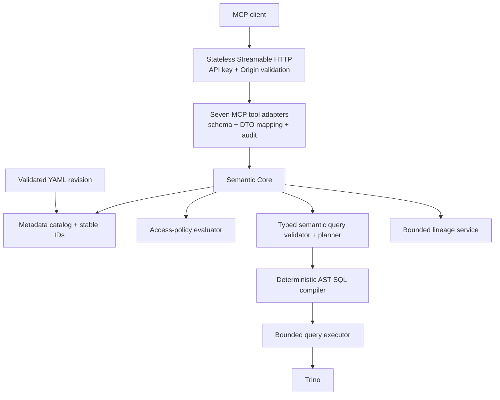

# Witness MCP discovery and query interface

Witness exposes a stateless Streamable HTTP MCP endpoint at `POST /api/mcp`. It is a
semantic-layer server, not a generic database server and not a text-to-SQL service. Every tool
resolves the active, validated YAML revision and delegates metadata, policies, planning,
compilation, and execution to Semantic Core.

The implementation uses the official [MCP Java SDK](https://java.sdk.modelcontextprotocol.io/latest/)
2.0.0 with its Servlet stateless transport and Jackson 2 adapter. The SDK version implements MCP
protocol `2025-11-25`. Tool contracts are additive and do not depend on an MCP session.

## Architecture



MCP-specific code is under `com.acme.semantic.mcp`. Business rules live under
`com.acme.semantic.core` and reuse `SemanticCatalog`, `AstSemanticSqlCompiler`, and
`QueryExecutor`. MCP has no private catalog, metric definitions, SQL generator, or identity
arguments.

## Connect

Start Witness normally, then configure an MCP client with:

```text
URL: http://localhost:8080/api/mcp
Transport: Streamable HTTP
Header: X-API-Key: dev-secret
Protocol version: 2025-11-25
```

A low-level initialization request looks like this:

```bash
curl --request POST http://localhost:8080/api/mcp \
  --header 'Content-Type: application/json' \
  --header 'Accept: application/json, text/event-stream' \
  --header 'MCP-Protocol-Version: 2025-11-25' \
  --header 'X-API-Key: dev-secret' \
  --data '{
    "jsonrpc": "2.0",
    "id": 1,
    "method": "initialize",
    "params": {
      "protocolVersion": "2025-11-25",
      "capabilities": {},
      "clientInfo": {"name": "local-client", "version": "1.0"}
    }
  }'
```

Use a secret manager for non-local keys. The fixed demo key is not a production credential.

## Stable IDs

MCP accepts only domain-qualified semantic IDs:

| Kind | Format | Example |
|---|---|---|
| Semantic object | `domain.object` | `retail.orders` |
| Metric | `domain.metric` | `retail.total_revenue` |
| Dimension | `domain.object.dimension` | `retail.orders.created_at` |

Display labels are never accepted as query identifiers. Search resolves names, titles, optional
aliases, descriptions, and tags to these IDs.

## Canonical semantic query

`compile_semantic_query` and `query_metrics` consume exactly the same query object:

```json
{
  "metrics": ["retail.total_revenue"],
  "dimensions": [
    {"id": "retail.orders.created_at", "granularity": "month"},
    {"id": "retail.customers.country"}
  ],
  "filters": {
    "operator": "and",
    "conditions": [
      {
        "member": "retail.orders.created_at",
        "operator": "between",
        "values": ["2026-01-01", "2026-06-30"]
      },
      {
        "member": "retail.orders.status",
        "operator": "in",
        "values": ["paid", "completed"]
      }
    ]
  },
  "orderBy": [
    {"member": "retail.total_revenue", "direction": "desc"}
  ],
  "limit": 100,
  "timezone": "Europe/Moscow"
}
```

Supported filter operators are `eq`, `neq`, `in`, `not_in`, `gt`, `gte`, `lt`, `lte`,
`between`, `is_null`, and `is_not_null`. Values are type-checked against the dimension. Filters
accept dimensions only in schema v1; arbitrary expressions, raw `WHERE`, SQL, credentials, and
identity fields are rejected. Time granularities are `day`, `week`, `month`, `quarter`, and
`year` and apply only to date/timestamp dimensions.

The planner resolves one deterministic shortest path through declared relationships. Missing and
ambiguous paths fail. Each metric is checked across the complete path; a join that could duplicate
its base grain fails before execution.

## Tools

MCP `tools/list` returns exactly the following seven tools.

### `search_semantic_objects`

Use for bounded lexical discovery. Results are access-filtered, scored deterministically, and
ordered by score, type, and ID. `cursor` is opaque and revision-bound.

Request arguments:

```json
{
  "query": "revenue",
  "objectTypes": ["metric"],
  "domain": "retail",
  "tags": ["finance"],
  "certified": true,
  "limit": 10
}
```

Structured result:

```json
{
  "results": [
    {
      "id": "retail.total_revenue",
      "type": "metric",
      "name": "total_revenue",
      "title": "Total revenue",
      "description": "Revenue from completed orders",
      "domain": "retail",
      "tags": ["revenue", "finance"],
      "certified": true,
      "score": 0.76,
      "matchReasons": ["name, title, or ID match"]
    }
  ],
  "nextCursor": null,
  "semanticRevision": "...",
  "traceId": "..."
}
```

### `get_semantic_object`

Use for the authoritative compiled definition after discovery. Physical source SQL and connection
details are intentionally absent.

Request arguments:

```json
{"id": "retail.orders.created_at"}
```

Structured result:

```json
{
  "id": "retail.orders.created_at",
  "type": "dimension",
  "name": "created_at",
  "title": "Created at",
  "description": null,
  "domain": "retail",
  "owner": "analytics-platform",
  "tags": ["sales", "finance"],
  "aliases": [],
  "certified": false,
  "deprecated": false,
  "definition": {
    "semanticObject": "retail.orders",
    "dataType": "timestamp",
    "role": "dimension",
    "nullable": true
  },
  "semanticRevision": "...",
  "freshness": {},
  "traceId": "..."
}
```

### `get_metric_context`

Use before composing a query. Compatible dimensions come from actual unique, fan-out-safe graph
paths rather than the whole catalog.

Request arguments:

```json
{"metricId": "retail.total_revenue"}
```

Structured result (abridged):

```json
{
  "metric": {
    "id": "retail.total_revenue",
    "title": "Total revenue",
    "metricType": "sum",
    "unit": "currency",
    "defaultCurrency": null,
    "certified": true,
    "additivity": "additive"
  },
  "grain": ["retail.orders.order_id"],
  "defaultTimeDimension": "retail.orders.created_at",
  "supportedTimeGranularities": ["day", "week", "month", "quarter", "year"],
  "compatibleDimensions": [
    {
      "id": "retail.customers.country",
      "title": "Country",
      "type": "varchar",
      "joinPath": ["order_customer"]
    }
  ],
  "entities": ["retail.orders"],
  "requiredFilters": [],
  "owners": ["finance-analytics"],
  "freshness": {},
  "knownLimitations": [],
  "semanticRevision": "...",
  "traceId": "..."
}
```

### `get_dimension_values`

Use for small filter-value discovery. The request is planned through Semantic Core as a bounded
`DISTINCT` semantic query; it is not an unrestricted physical `SELECT DISTINCT`. Primary-key and
`*_id` dimensions require search text or selective semantic filters. Text search is prefix-based.

Request arguments:

```json
{
  "dimensionId": "retail.customers.country",
  "metricIds": ["retail.total_revenue"],
  "search": "F",
  "limit": 20
}
```

Structured result:

```json
{
  "dimension": {"id": "retail.customers.country", "type": "varchar"},
  "values": [{"value": "FI", "label": "FI"}],
  "nextCursor": null,
  "truncated": false,
  "semanticRevision": "...",
  "execution": {"durationMs": 24, "engineQueryId": null},
  "traceId": "..."
}
```

### `compile_semantic_query`

Use for full validation and planning without data execution. Compiled Trino SQL is `null` unless
both server configuration and access policy allow it.

Request arguments:

```json
{"query": {"metrics": ["retail.total_revenue"], "limit": 100}}
```

Structured result:

```json
{
  "valid": true,
  "normalizedQuery": {
    "metrics": ["retail.total_revenue"],
    "dimensions": [],
    "orderBy": [],
    "limit": 100,
    "timezone": "UTC"
  },
  "semanticRevision": "...",
  "plan": {
    "metrics": ["retail.total_revenue"],
    "dimensions": [],
    "models": ["retail.orders"],
    "joinPath": [],
    "estimatedComplexity": "low"
  },
  "appliedPolicySummary": ["Authenticated catalog read policy"],
  "warnings": [],
  "errors": [],
  "compiledSql": null,
  "traceId": "..."
}
```

A semantically invalid request remains a successful tool invocation with `valid: false` and
structured issues. Authentication and inaccessible/not-found IDs remain tool errors to avoid
metadata leakage.

### `query_metrics`

Use to execute the same canonical query accepted by `compile_semantic_query`. Witness requests one
extra row internally so truncation is detected rather than silently hidden.

Request arguments:

```json
{
  "query": {
    "metrics": ["retail.total_revenue"],
    "dimensions": [{"id": "retail.customers.country"}],
    "limit": 100,
    "timezone": "UTC"
  }
}
```

Structured result:

```json
{
  "queryId": "...",
  "semanticRevision": "...",
  "columns": [
    {"name": "retail.customers.country", "type": "varchar", "role": "dimension", "unit": null, "nullable": true},
    {"name": "retail.total_revenue", "type": "decimal(18,2)", "role": "metric", "unit": "currency", "nullable": true}
  ],
  "rows": [["FI", 1289000.20]],
  "rowCount": 1,
  "truncated": false,
  "freshness": {},
  "warnings": [],
  "appliedPolicySummary": ["Authenticated catalog read policy"],
  "execution": {"durationMs": 120, "engineQueryId": null},
  "traceId": "..."
}
```

### `get_lineage`

Use for bounded, cycle-safe semantic graph traversal. Edges point from upstream to downstream.
Every node and edge is access-filtered.

Request arguments:

```json
{
  "objectId": "retail.total_revenue",
  "direction": "upstream",
  "maxDepth": 3,
  "objectTypes": ["metric", "dimension", "semantic_object"],
  "includePhysical": false
}
```

Structured result:

```json
{
  "root": "retail.total_revenue",
  "nodes": [
    {"id": "retail.orders", "type": "semantic_object", "title": "Orders", "layer": "semantic"},
    {"id": "retail.total_revenue", "type": "metric", "title": "Total revenue", "layer": "semantic"}
  ],
  "edges": [
    {"from": "retail.orders", "to": "retail.total_revenue", "type": "DERIVES", "layer": "semantic"}
  ],
  "truncated": false,
  "semanticRevision": "...",
  "traceId": "..."
}
```

## Error model

Tool errors set MCP `isError: true` and return the same object in `structuredContent` and JSON text
content:

```json
{
  "code": "INCOMPATIBLE_METRICS_AND_DIMENSIONS",
  "message": "A requested join path can duplicate rows behind metric retail.total_revenue",
  "retryable": false,
  "traceId": "...",
  "details": {"metric": "retail.total_revenue"},
  "suggestions": ["Use get_metric_context to select a fan-out-safe dimension"]
}
```

Codes include `INVALID_TOOL_ARGUMENTS`, `SEMANTIC_OBJECT_NOT_FOUND`,
`INVALID_SEMANTIC_QUERY`, `INCOMPATIBLE_METRICS_AND_DIMENSIONS`, `AMBIGUOUS_JOIN_PATH`,
`ACCESS_DENIED`, `QUERY_LIMIT_EXCEEDED`, `COMPILATION_FAILURE`, `EXECUTION_TIMEOUT`,
`EXECUTION_FAILURE`, and `HIGH_CARDINALITY_SEARCH_REQUIRED`. Inaccessible IDs use the same
not-found response as missing IDs.

## Authentication, authorization, and audit

- `X-API-Key` is verified on every HTTP request with constant-time comparison.
- If `Origin` is present, its authority must equal `Host` to prevent DNS rebinding.
- The transport creates the `SemanticPrincipal`; no tool schema accepts `user`, `role`, `tenant`,
  credentials, or connection properties.
- `SemanticAccessPolicy` is evaluated before metadata, path planning, dimension values, lineage,
  compilation, and execution.
- Policy implementations may return typed required row filters. Semantic Core resolves them as
  trusted semantic dimensions and always combines them with user filters using `AND`; their values
  and hidden member IDs are not returned to the MCP caller.
- Tool audit logs contain principal, tool, semantic revision, duration, status, trace ID, and query
  ID. Arguments, SQL parameters, and result rows are never written to the audit log.
- Compiled SQL and physical lineage are disabled by default.

The current default policy represents the repository's existing single API-key security model and
grants that authenticated principal catalog-wide read access. YAML schema v1 does not yet define
row-level or column-level policy documents, so the default policy supplies no automatic filters. A
production deployment can replace `DefaultSemanticAccessPolicy` and use the existing Core policy
hooks without changing any of the seven tool contracts.

## Limits and timeouts

| Setting | Default | Meaning |
|---|---:|---|
| `MCP_SEARCH_MAX_RESULTS` | `50` | Maximum discovery page |
| `MCP_QUERY_DEFAULT_ROWS` | `100` | Default metric result rows |
| `MCP_QUERY_MAX_ROWS` | `500` | Hard MCP metric result limit |
| `MCP_DIMENSION_DEFAULT_ROWS` | `20` | Default dimension-value page |
| `MCP_DIMENSION_MAX_ROWS` | `100` | Hard dimension-value page limit |
| `MCP_LINEAGE_MAX_DEPTH` | `5` | Maximum traversal depth |
| `MCP_LINEAGE_MAX_NODES` | `250` | Maximum returned lineage nodes |
| `QUERY_TIMEOUT_SECONDS` | `30` | Trino statement timeout |
| `TRINO_POOL_SIZE` | `10` | Shared query concurrency bound |

Client limits cannot override these maximums. JDBC statement timeouts propagate through the Trino
driver. HTTP disconnect cancellation is not yet wired to `Statement.cancel()`; use the bounded
timeout until a reusable Core cancellation service is added.

## Semantic revisions

Every result includes the active model revision. Pagination cursors encode that revision and fail
after activation changes, preventing pages from mixing definitions. Tool calls never keep a hidden
revision or query connection between requests.

## Local development and tests

```bash
./gradlew test
```

The suite includes contract tests for all seven tools, strict arguments, identity rejection,
metadata authorization, typed filters, compatibility, compilation without execution, decimal
results, truncation, high-cardinality dimension values, cycle-safe lineage, transport security,
and an actual HTTP MCP protocol invocation. Query tests use a fake executor and do not require an
external production database.

For manual protocol inspection, point an MCP Inspector-compatible client at
`http://localhost:8080/api/mcp` with the API-key header.

## Known limitations and extensions

- Schema v1 has no row/column policy documents, freshness SLA, currency conversion, or explicit
  source-timezone metadata.
- Schema v1 certification is inferred from complete owner and description metadata; a
  revision-bound approval/certification record is not modeled yet.
- Timezone IDs are validated and normalized. Timestamp bucketing currently uses the configured
  Trino session timezone because source timezone is not modeled.
- Metric filters in ad hoc canonical queries accept dimensions only. Governed metric-definition
  filters are always applied by the compiler.
- Query execution is synchronous and intentionally small. If long-running workloads are needed,
  add a Core query-job service and additive handle/status tools; do not store connection state in
  MCP.
- Client disconnect cancellation does not currently propagate to Trino; statement timeout remains
  the hard execution bound.
- Physical lineage is opt-in and currently covers direct table sources. Derived SELECT source
  tables remain hidden until a reusable, policy-aware physical lineage extractor exists in Core.
- MCP is read-only. Future authoring tools should call the existing validated GitLab change/MR
  service and should be introduced as separate, explicitly reviewed tool contracts.
